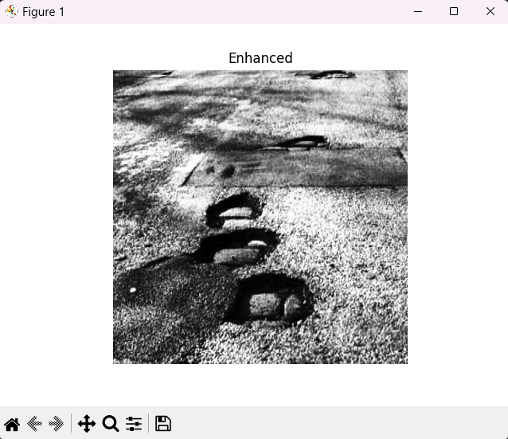
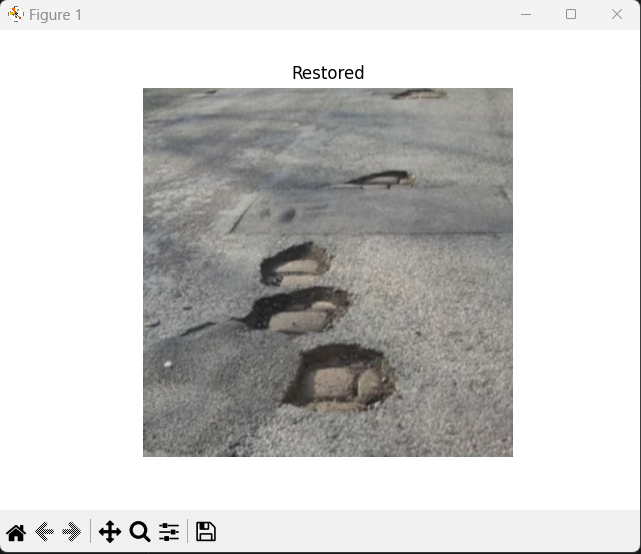
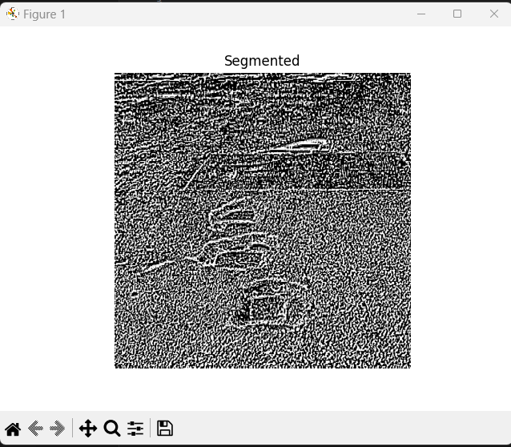
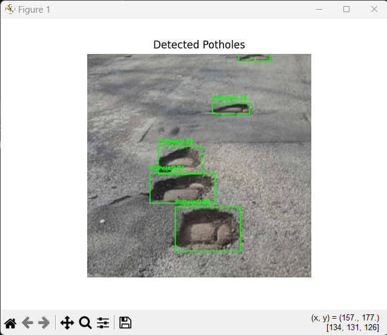

# Pothole Detection System using YOLOv8 & Digital Image Processing

## Project Overview

This project presents a hybrid pothole detection system that combines **Digital Image Processing (DIP)** techniques with **YOLOv8 deep learning detection**.
It supports pothole identification from **images, videos, and live camera feed**, while also allowing visualization of each processing stage through a GUI.

The system demonstrates both traditional image processing pipelines and modern object detection in one unified application.

---

## Digital Image Processing Pipeline Results

### GUI Interface


### Enhancement (Histogram Equalization)



### Restoration (Gaussian Blur)



### Morphological Processing


### Segmentation Output



### Final Pothole Detection (YOLOv8)



### Full Demo


---

## Features

* Upload image or video for analysis
* Step-wise visualization of DIP pipeline stages
* Pothole detection on:

  * Images
  * Videos
  * Live camera feed
* Custom-trained YOLOv8 model support
* Modular and scalable project architecture
* GUI interface built with Tkinter

---

## Model Training (Google Colab)

The YOLOv8 model was trained on Google Colab using a custom pothole dataset.

Training workflow:

1. Dataset annotation and conversion to YOLO format
2. Training with Ultralytics YOLOv8
3. Exporting best weights (`best.pt`)
4. Downloading trained model for local inference

After training, place the model file here:

```
pothole-detection/models/best.pt
```

---

## 📂 Project Structure

```
pothole-detection/
│
├── main.py
├── gui/
├── processing/
├── detection/
├── utils/
├── models/
│   └── best.pt
├── screenshots/
├── requirements.txt
└── README.md
```

---

## Installation

### Clone the repository

```
git clone https://github.com/avxway/pothole-detection-system.git
cd pothole-detection-system
```

### Install dependencies

```
pip install -r requirements.txt
```

---

## Running the Application

```
python main.py
```

The GUI window will open.

---

## How to Use

1. Click **Upload Image/Video**
2. Explore each DIP processing stage
3. Run detection on image, video, or live camera
4. Press **q** to stop video/camera detection

---

## Technologies Used

* Python
* OpenCV
* NumPy
* Matplotlib
* Tkinter
* Ultralytics YOLOv8
* PyTorch

---

## 🚀 Future Improvements

* Web dashboard deployment
* Mobile detection system
* Road damage severity estimation
* Automated pothole reporting to authorities

---

## 👨‍💻 Author

**Anmol Verma**

---

## 📜 License

This project is created for academic and research purposes.
